## 图标制作标准


☼ 新增的"svg"文件，需要更新到下面的表格中，保证信息同步。

☼ "svg"放到项目目录之前，需要简单手动处理（本来计划写个脚本处理的，待做吧）

> 以下处理仅适用于处理禾静当前的设计规范下导出的"svg"文件

2. 删除"svg"上的 "id" 和"data-name"属性
3. 删除"style"标签
4. 删除"title"标签
5. 如果"defs"标签是空的，删除
6. 删除"class"属性

处理前：

```
<svg id="图层_1" data-name="图层 1" xmlns="http://www.w3.org/2000/svg" viewBox="0 0 40 40"><defs><style>.cls-1{fill:#767d87;}</style></defs><title>澜图icon</title><path class="cls-1" d="M29.08,26.38l-2.81,2.84,8.39,8.24,2.8-2.88ZM16.59,30.65A14.06,14.06,0,1,1,30.65,16.59,14.06,14.06,0,0,1,16.59,30.65Zm.06-4A10.07,10.07,0,1,0,6.58,16.54,10.07,10.07,0,0,0,16.65,26.6Z"/></svg>
```

处理后：

```
<svg xmlns="http://www.w3.org/2000/svg" viewBox="0 0 40 40"><path d="M29.08,26.38l-2.81,2.84,8.39,8.24,2.8-2.88ZM16.59,30.65A14.06,14.06,0,1,1,30.65,16.59,14.06,14.06,0,0,1,16.59,30.65Zm.06-4A10.07,10.07,0,1,0,6.58,16.54,10.07,10.07,0,0,0,16.65,26.6Z"/></svg>
```

## 折线图

| 预览 | 文件名(即 "id" ) | 用途 | 备注 | 
|---|---|---|---|
|  | basic-line | 基础折线图 | | 
|  | multi-line | 多折线图 | 2个以上纬度数值的基础折线图 | 
|  | predicted-line | 实时预测图 | 用于实时预测场景，一半实线一半虚线 | 
|  | area | 面积图 | | 
|  | river | 河流图 | 一种堆叠面积图 | 
|  | d-value | 剪刀差图 | 一种区间面积图，第一个值减去第二个值的区域，有正负 |

## 柱状图

| 预览 | 文件名(即 "id" ) | 用途 | 备注 | 
|---|---|---|---|
| 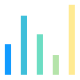 | basic-column | 基础柱状图 | | 
|  | interval-column | 区间柱状图 | | 
|  | grouped-column | 分组柱状图 | | 
|  | stacked-column | 堆叠柱状图 | | 
|  | waterfall | 瀑布图 | | 
| 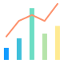 | line-column | 折柱图 | | 
|  | grouped-line-column | 分组折柱图 | |
|  | renju | 连珠 | |
| 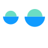 | semicircle | 玄月 | |
| 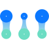 | vertical-hourglass | 垂直沙漏 | |

## 条形图

| 预览 | 文件名(即 "id" ) | 用途 | 备注 | 
|---|---|---|---|
|  | basic-bar | 基础条形图 | 横向基础柱状图 | 
|  | range-bar | 区间条形图 | 横向区间柱状图 |
|  | grouped-bar | 分组条形图 | | 
|  | stacked-bar | 堆叠条形图 | | 
|  | radial-bar | 玉珏图 | | 
| 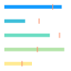 | bullet | 子弹图 | | 
| 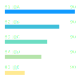 | ordered-list | 排行榜 | |
|  | Horizontal-hourglass | 水平沙漏 | |

## 饼图

| 预览 | 文件名(即 "id" ) | 用途 | 备注 | 
|---|---|---|---|
|  | pie | 饼图 |  | 
|  | donut | 环图 |  | 
|  | nightingale-rose | 蓝丁格尔 |  | 
|  | cicular-nightingale-rose | 环型蓝丁格尔 | 低优先级 | 
|  | sunburst | 旭日图 | 低优先级 |

## 点图

| 预览 | 文件名(即 "id" ) | 用途 | 备注 | 
|---|---|---|---|
|  | scatter | 散点图 |  | 
|  | bubble | 气泡图 |  | 
|  | customized-bubble | 自定义气泡图 | 带icon的气泡图，低优先级 | 

## 箱图

| 预览 | 文件名(即 "id" ) | 用途 | 备注 | 
|---|---|---|---|
| 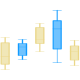 | boxes | 箱型图 | 低优先级 | 
| 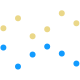 | high-low | 高低图 |  | 

## 雷达图

| 预览 | 文件名(即 "id" ) | 用途 | 备注 | 
|---|---|---|---|
|  | radar | 雷达图 |  | 
|  | multi-radar | 多值雷达图 | 2个以上纬度数值的雷达图 | 

## 热力图

| 预览 | 文件名(即 "id" ) | 用途 | 备注 | 
|---|---|---|---|
| 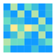 | heatmap | 热力图 |  | 

## 分面图

| 预览 | 文件名(即 "id" ) | 用途 | 备注 | 
|---|---|---|---|
| 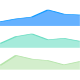 | line-facet| 折线图分面 | 低优先级 | 
| 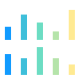 | column-facet | 柱状图分面 | 低优先级 | 
| 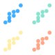 | scatter-facet | 点图分面 | 低优先级 | 
|  | cicular-indicator-facet | 环形指标卡分面 | 低优先级 | 

## 关系图

| 预览 | 文件名(即 "id" ) | 用途 | 备注 | 
|---|---|---|---|
|  | circle-funnel | 漏斗图 |  | 
|  | sankey | 桑基图 |  | 
| 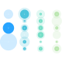 | bead-curtain | 珠帘 |  |
|  | pack | 边缘捆图 |  | 

## 基础地图

| 预览 | 文件名(即 "id" ) | 用途 | 备注 | 
|---|---|---|---|
|  | China-map | 中国地图 |  | 
|  | world-map | 世界地图 | 低优先级 | 

## GIS地图

| 预览 | 文件名(即 "id" ) | 用途 | 备注 | 
|---|---|---|---|
|  | GIS | GIS地图 |  | 

## 聚焦系列

| 预览 | 文件名(即 "id" ) | 用途 | 备注 | 
|---|---|---|---|
|  | peacock | 孔雀 |  | 
|  | windmill | 风车 |  | 
| 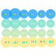 | value-matrix | 矩阵 |  | 

## 其它图表

| 预览 | 文件名(即 "id" ) | 用途 | 备注 | 
|---|---|---|---|
|  | text | 文本 | | 
|  | gauge | 仪表盘 |  | 
|  | multicolor-gauge | 多色仪表盘 | 低优先级 | 
| 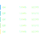 | form | 表格 | | 
|  | indicator | 指标卡 | | 
|  | cicular-indicator | 环形指标卡 |  | 
|  | word-cloud | 词云 | | 

## 多媒体

| 预览 | 文件名(即 "id" ) | 用途 | 备注 | 
|---|---|---|---|
|  | picture | 图片 | | 
|  | video | 视频 | 低优先级 | 

## 交互组件

| 预览 | 文件名(即 "id" ) | 用途 | 备注 | 
|---|---|---|---|
|  | button | 按钮 | 低优先级 |
|  | input | 输入框 | 低优先级 |  
|  | select | 选择器 | 低优先级 | 
|  | datepicker | 日期选择器 | 低优先级 | 
|  | ui-search | 搜索框 | 低优先级 | 
|  | input | 输入框 | 低优先级 | 
|  | catalog | 目录树 | 低优先级 | 
|  | iframe | 嵌套页面 | 低优先级 | 
|  | switch | 开关 | 低优先级 | 

## 占位图

| 预览 | 文件名(即 "id" ) | 用途 | 备注 | 
|---|---|---|---|
|  | placeholder | 占位图 | 低优先级 | 